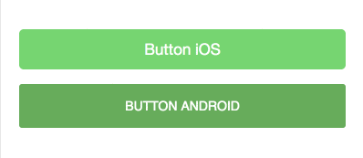
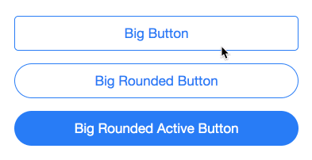

# morph-button

[](https://opensource.org/licenses/Apache-2.0) [](https://www.webcomponents.org/element/PolymerElements/paper-progress)

Button that looks native and morphs automatically for current mobile OS whether IOS or Android. 

`morph-button` changes its look based on when it is either IOS device or Android device.

<!---
```
<custom-element-demo>
  <template>
    <script src="../webcomponentsjs/webcomponents-lite.js"></script>
    <link rel="import" href="../morph-shared-colors/morph-shared-colors.html">
        <link rel="import" href="../morph-shared-styles/morph-shared-styles.html">
    <link rel="import" href="morph-button.html">
    <next-code-block></next-code-block>
  </template>
</custom-element-demo>
```
-->

```html
<morph-button platform="android" filled big color="green">button android</morph-button>
<br>
<morph-button platform="ios" filled big color="green">button ios</morph-button>
```

## Getting Started

For the information about how to clone the desired repository, running the local server and testing, please refer to Polymorph elements getting started docs at the end of this repository.

## Demo

Here is a quick demo of morph button

<p align="center" >
  
</p>

<p align="center" >
  
</p>

  ```html

  <template>
    <p><morph-button platform="ios" filled big color="green">Button iOS</morph-button></p>
    <p><morph-button platform="android" filled big color="green">Button Android</morph-button></p>
  </template>

  ```

## Attributes

|     Custom Attribute    |   Type  |               Description               | Default |
|:-----------------------:|:-------:|:---------------------------------------:|:-------:|
|           **`big`**           | Boolean | Identifies if the button is big.        |  False  |
|          **`filled`**         | Boolean | Identifies if the button is filled.     |  False  |
|          **`flat`**           | Boolean | Identifies if the button has no rounded corners.     |  False  |
|          **`color`**          |  String | Identifies the color of the button      | 'blue'  |
|   **`active`**<br> <sub>IOS only</sub>   | Boolean | Shows if the button is in active state. |  False  |
| **`rounded`**<br> <sub>IOS only</sub>  | Boolean | Identifies if the button is rounded.    |  False  |
| **`raised`**<br> <sub>Android only</sub> | Boolean | Identifies if the button is raised.     |  False  |

- To use default colors, include `morph-shared-colors` in the `morph-button`

## Styling

-For Android platform;

Custom property                  | Description                            | Default
---------------------------------|----------------------------------------|--------------------
`--color`                        | Color of the button                    | #0076FF
`--ripple-color`                 | Color of the ripple effect on button   | `var(--color)`
`--active-color--background`     | Background color of active button      | #0D82DF
`--filled-text-color`            | Text color of the filled button        | white
`--font-size`                    | Font size of the button                | 14px

-For IOS platform;

Custom property                  | Description                            | Default
---------------------------------|----------------------------------------|--------------------
`--color`                        | Color of the button                    | #007aff
`--active-color--background`     | Background color of active button      | rgba(0, 122, 255, 0.15)
`--filled-text-color`            | Text color of the filled button        | white
`--font-size`                    | Font size of the button                | 14px

## Further help

For more information on how to install and run test please go here - [Polymorph elements getting started]

[Polymorph elements getting started]: https://github.com/moduware/polymorph-components/blob/master/INFO.md
